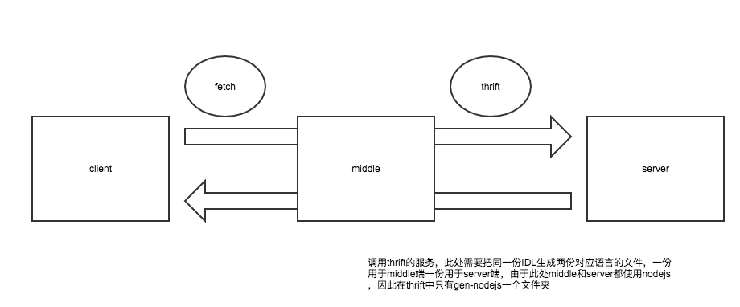

# 项目介绍
[README in English](https://github.com/wengwengweng/thrift-demo/blob/master/README-EN.md)  

这个项目用来帮助那些对thrift感兴趣的前端们上手thrift，  
你可以把它认为是一个简易的使用案例或是指南，  
毕竟thrift的官方文档真的很简单...
# 为什么使用Thrift
Thrift是一种接口描述语言和二进制通讯协议，  
可以用来进行服务端与服务端的通信。  
与http相比他有很多优点：
- 跨语言，自动生成不同语言的接口代码，这在开发中用处很大，可以使你在联调之前就确保传输的参数类型和字段没有问题，大大减少bug出现率。
- 与HTTP相比更加紧凑，但同时可扩展性也很强，支持加密、非阻塞、异步等功能。
- 数据传输效率高，负载低，支持多种序列化技术。  

一些劣势：
- 接口代码根据IDL自动生成，当数据结构变化时，需重新编辑IDL文件，生成代码。（ 这一点可以通过写脚本解决这个问题 ）
- 社区和技术文档很不全面。

以上都是一些在哪都能查得到的优劣对比...  

其实当前端业务越来越复杂，  
后端所提供的服务不管是数量还是种类都越来越多，  
RPC协议的重要性才会凸显出来，  
因为一个前端应用需要调用各种服务，  
需要一个中间层来做不同服务的整合，  
中间层与真正后端的通信使用像Thrift这样的RPC协议就再合适不过了。  
其实项目架构中的图主要就解释了这一点。（ 如果有读者对这个不是很了解可以阅读一下我的这篇 [日记](https://github.com/wengwengweng/thrift-demo/blob/master/README-EN.md) ）

注意 : 这个项目主要是为前端们提供上手帮助而非细节讲解。

# 项目架构

以我对thrift一些浅薄的理解，它的应用整体架构因该是如下图所示的：  


# 主要的文件结构
```
-|
 |- client                 // 前端
 |                          
 |- middle                 // 中间层
 |  
 |- server                 // 真正的后端
 |
 |- thrift -|              // 存放与thrift相关文件的文件夹
            |
            |- gen-nodejs  // 存放.js文件的文件夹
            |
            |- .thrift     // 存放.thrift文件的文件夹

 // 注意:
 这个项目使用node作为服务端的开发语言，  
 部分代码衍生自官网的实例，  
 但是它比官网的代码更加完整，  
 可以让你了解thrift的完整使用流程。
```

将会被用到的前端框架或前端库以及使用原因:
- 客户端 : vue  
  使用原因 : 尝试一下而已，但是使用vue-cli构建项目真的很方便，对vue不熟悉的渎职只需关注 @client/src/App.vue 中的代码即可;

- 中间层 : koa做router处理, thrift连接真正的后端  
  使用原因 : 因为它是一个真的很轻量的nodejs库，作为demo真的是再适合不过了;

- 服务端 : thrift  
  使用原因 : 通常的，这里会使用java等一些稳定高效的后端语言，但是为了方便前端们的阅读也为了方便编写，这里还是使用node.

# 如何使用
- 首先你需要通过 `npm run server` 启动服务端的服务；
- 接下来你需要通过 `npm run middle` 启动中间层的服务；
- 最后你需要 `cd client` 进入client文件夹，并执行 `npm run dev` 来启动客户端；
- 当你在客户端出发事件，你将看到从服务端传回的数据，追踪数据的流向，你将明白thrift的使用方式。

数据流向图：  


# 最后
欢迎大家来提出问题与建议，并做补充。
